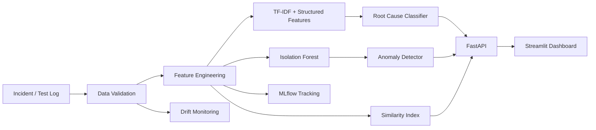

# IncidentSense AI 🧠

**Production-style incident and test-failure intelligence using machine learning.**

IncidentSense AI ingests structured application/test incident records and log messages, then combines **NLP text features, structured telemetry, anomaly detection, similarity search, model explanations, FastAPI serving, monitoring, Docker, and CI** into one end-to-end ML system.

The project is intentionally aligned with real engineering workflows: a model is not treated as a notebook artifact. It is trained reproducibly, evaluated on a held-out set, serialized, exposed through an API, consumed by a dashboard, and monitored for data drift.

> Current demo baseline: **88.3% accuracy / 88.3% macro F1** on a deliberately noisy 3,000-row synthetic incident benchmark. These metrics are for the included demo dataset and are not claims about production performance.

## Why this project is valuable for an AI/ML Engineer portfolio

It demonstrates:

- supervised NLP classification with TF-IDF + Logistic Regression
- structured + text feature fusion
- unsupervised anomaly detection with Isolation Forest
- similarity retrieval using TF-IDF + cosine similarity
- model-native feature explanations
- reproducible training and held-out evaluation
- REST model serving with FastAPI
- interactive inference dashboard with Streamlit
- data drift checks using PSI
- ML experiment tracking through optional MLflow integration
- Dockerized deployment and GitHub Actions CI
- unit/API tests and linting

## Architecture



## ML pipeline

### 1. Data
The repository includes a deterministic demo generator so a new clone can reproduce the same benchmark.

### 2. Feature engineering
The classifier combines:

- **TF-IDF word and bigram features** from incident messages and operational tokens
- one-hot encoded categorical signals: service, environment, severity, error code
- scaled numeric signals: latency, HTTP status, severity level, hour of day

### 3. Root-cause classification
A balanced **Logistic Regression** model predicts one of six incident classes:

`database`, `dependency`, `auth`, `network`, `resource`, `application`

The evaluation uses a stratified hold-out test split and reports accuracy, macro F1 and weighted F1.

### 4. Anomaly detection
**Isolation Forest** scores unusual combinations of latency, HTTP status, severity and time-of-day features.

### 5. Similar-incident retrieval
A TF-IDF similarity index retrieves historical incidents that are closest to a new incident, giving an operator context for triage.

### 6. Explainability
For a prediction, the API exposes high-weight model features that contributed to the selected class. This is intentionally lightweight and model-native rather than an opaque explanation layer.

### 7. Monitoring
The `/drift` endpoint calculates **Population Stability Index (PSI)** for key numeric features and classifies each metric as `stable`, `watch`, or `drift`.

## API

Run the API locally:

```bash
make train
make api
```

Swagger UI: `http://localhost:8000/docs`

Health check:

```bash
curl http://localhost:8000/health
```

Prediction:

```bash
curl -X POST http://localhost:8000/predict \
  -H "Content-Type: application/json" \
  -d '{
    "service": "orders",
    "environment": "production",
    "severity": "ERROR",
    "error_code": "DB_QUERY",
    "http_status": 500,
    "latency_ms": 1300,
    "log_message": "database query exceeded timeout"
  }'
```

Full analysis (`prediction + anomaly + similar incidents`):

```bash
curl -X POST http://localhost:8000/analyze \
  -H "Content-Type: application/json" \
  -d '{
    "service": "orders",
    "environment": "production",
    "severity": "ERROR",
    "error_code": "DB_QUERY",
    "http_status": 500,
    "latency_ms": 1300,
    "log_message": "database query exceeded timeout"
  }'
```

## Dashboard

```bash
make train
API_URL=http://localhost:8000 streamlit run app/streamlit_app.py
```

The UI provides:

- root-cause prediction
- confidence and probability distribution
- anomaly status
- similar historical incidents
- model-quality metrics

## Docker

```bash
docker compose up --build
```

Then open:

- API: `http://localhost:8000/docs`
- Dashboard: `http://localhost:8501`

## Development

```bash
python -m pip install -e '.[dev]'
make data
make train
make test
make lint
```

## Repository structure

```text
IncidentSense-AI/
├── app/
│   └── streamlit_app.py
├── data/raw/
│   └── demo_incidents.csv  # generated locally by make data
├── artifacts/
│   ├── root_cause_model.joblib  # generated locally by make train
│   └── anomaly_model.joblib     # generated locally by make train
├── reports/
│   └── metrics.json
├── scripts/
│   ├── check_data.py
│   ├── generate_demo_data.py
│   └── train_model.py
├── src/incidentsense/
│   ├── api.py
│   ├── config.py
│   ├── data.py
│   ├── features.py
│   ├── inference.py
│   ├── models.py
│   ├── monitoring.py
│   ├── similarity.py
│   └── train.py
├── tests/
│   ├── test_api.py
│   ├── test_features.py
│   └── test_model.py
├── .github/workflows/ci.yml
├── docker-compose.yml
├── Dockerfile
├── Makefile
├── pyproject.toml
└── README.md
```

## Roadmap

### Phase 2
- ingest real Jenkins/Selenium/Playwright test-result exports
- replace the demo generator with historical failure data
- add transformer embeddings for semantic similarity
- support service-level incident clustering
- add precision/recall monitoring on reviewed incidents
- add model registry promotion workflow
- add scheduled retraining and champion/challenger evaluation

### Phase 3
- Kafka event ingestion
- PostgreSQL/TimescaleDB storage
- background inference workers
- role-based dashboard access
- production cloud deployment

## Resume-ready project description

**IncidentSense AI — ML Incident & Test Failure Intelligence**  
Built an end-to-end ML platform that classifies software incidents by root cause using TF-IDF and structured telemetry, detects anomalous events with Isolation Forest, retrieves similar historical failures, and serves predictions through FastAPI with a Streamlit dashboard. Added reproducible training/evaluation, model explanations, PSI-based drift monitoring, Docker deployment, CI tests, and optional MLflow experiment tracking.

## Engineering note

The demo data and trained model artifacts are intentionally generated during setup rather than committed to the repository. This keeps the Git history lightweight and makes the benchmark reproducible with `make data` and `make train`.

The included dataset is synthetic and exists to make the repository reproducible without licensing, privacy, or credential dependencies. The intended next step is to connect the pipeline to **real, anonymized CI/test logs** and evaluate against a production-labeled dataset before making operational claims.
